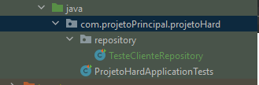

# [site sobre TEST no spring](https://spring.io/blog/2016/04/15/testing-improvements-in-spring-boot-1-4)
## Começando os testes
para se comçar a realizar testes no sprign se precisa primariamente da instalação de uma dependencia
~~~xml
(...)
    <dependency>
        <groupId>org.springframework.boot</groupId>
        <artifactId>spring-boot-starter-test</artifactId>
        <scope>test</scope>
    </dependency>
    <dependency>
        <groupId>junit</groupId>
        <artifactId>junit</artifactId>
        <version>4.4</version>
        <scope>test</scope>
    </dependency>
(...)
~~~
### Configuração do properties 
basta apenas colocar essa linha de codigo ao .properties
~~~properties
spring.datasource.classname.driver-class-name=org.postgresql.Driver
~~~
caso esteje sendo utilizado o sgbd postgresql.

### Configurando os arquivos de testes

dentro do packge crie um outro, com o nome de repository e dentro de repository crie um arquivo java com a seguinte ideia  <strong>teste< nomeRepository ></strong> e basei-se no codigo abaixo para realizar um teste de criação ao banco de dados

~~~Java
package com.projetoPrincipal.projetoHard.repository;

import com.projetoPrincipal.projetoHard.model.Cliente;
import org.junit.Assert;
import org.junit.Test;
import org.junit.runner.RunWith;
import org.springframework.beans.factory.annotation.Autowired;
import org.springframework.boot.test.autoconfigure.jdbc.AutoConfigureTestDatabase;
import org.springframework.boot.test.autoconfigure.orm.jpa.AutoConfigureDataJpa;
import org.springframework.boot.test.autoconfigure.orm.jpa.DataJpaTest;
import org.springframework.test.context.junit4.SpringRunner;

@RunWith(SpringRunner.class)
@DataJpaTest
@AutoConfigureTestDatabase(replace = AutoConfigureTestDatabase.Replace.NONE)
public class TesteClienteRepository {
    @Autowired
    private ClienteRepository clienteRepository;

    @Test
    public void tentarSalvar(){
        Cliente cli = new Cliente("jao","jao@gmail.com");
        Cliente cliSalvo = clienteRepository.save(cli);

        Assert.assertNotNull(cliSalvo.getId());
    }

}

~~~