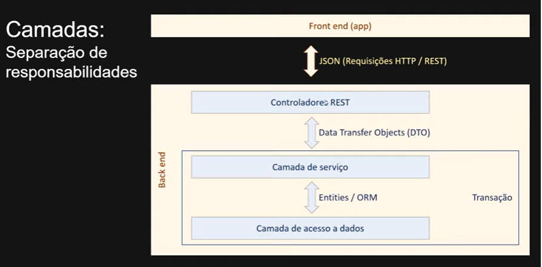
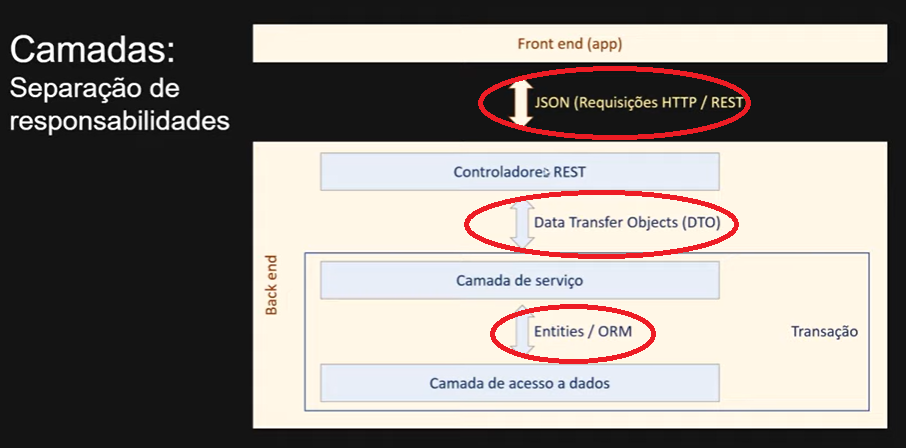

# Camadas

A primera coisa importate sobre camadas tem haver com a organização de camadas sendo elas 3.Podendo ser vistas na imagem acima

# camada 1 - controlador
ela tem a reposabilidade de responder as interaçoes do usuario.

# Camada 2 - service 
Realiza operaçoes de negocio.por exemlo 
realizarCompra()
para se executar a função realizarCompra se deve 
[verificarEstoque(), salvarPedido(), baixarEstoque(), enviarEmail()] 
ou seja ela faz uma serie de testes e manda a resposta para a camada de controlador e o controlador chama essa função de negocio do service/realizarCompra.

# Camada 3 - repository
Ela tem a funcionalidade de realizar operaçoes individuis ao banco de dados

# Transição de dados
É interessante ver que a transição de cada camada nos temos um metodo para realizar essa transferencia de dados como se poder ser vista na imagem

---
# Começando com o projeto
## Configuração do banco h2
sera usado as bibliotecas: 
spring Web, 
Spring Jpa, 
Spring H2 

começando fazendo a configuraçãod do banco h2 nas proprierities

~~~properties
spring.datasource.url=jdbc:h2:mem:testdb
spring.datasource.name=as
spring.datasource.password=

spring.h2.console.enabled=true
spring.h2.console.patch=/h2-console
~~~

## Criação do repository
primeiro crie um package chamado repositories e nele adicione uma interface java chamada de UserRepository e nesse userRepository basta apenas fazer as seguintes configuraçoes nele 

~~~java
public interface UserRepository extends JpaRepository<User,Long> {
}

~~~

## Crinação do DTO
deve se criar um package chamado dto e nesse package se deve criar uma classe java chama UserDto com as seguintes configurações.
os dtos sao aquilo que sera mostrado ao usuario.
~~~java
package com.DevSuperior.aula.dto;

import com.DevSuperior.aula.model.User;

public class UserDTO {
    private Long id;
    private String name;

    public UserDTO() {

    }

    public UserDTO(Long id, String name) {
        this.id = id;
        this.name = name;
    }

    public UserDTO(User user) {
        this.id = user.getId();
        this.name = user.getName();

    }
}

~~~

## Criação do service 
Crição da package service e da classe java UserService.

~~~java
package com.DevSuperior.aula.services;

import com.DevSuperior.aula.dto.UserDTO;
import com.DevSuperior.aula.model.User;
import com.DevSuperior.aula.repositories.UserRepository;
import org.springframework.beans.factory.annotation.Autowired;
import org.springframework.stereotype.Service;

@Service
public class UserService {

    @Autowired
    private UserRepository userRepository;

    public UserDTO UserFindById(Long id){
        User entity = userRepository.findById(id).get();
        return new UserDTO(entity);
    }
}

~~~

## Criação do controller 
Crição da package controler e da classe java UserController.