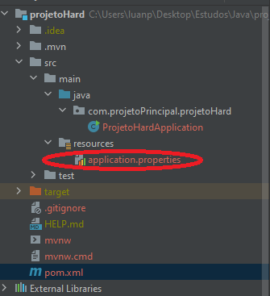
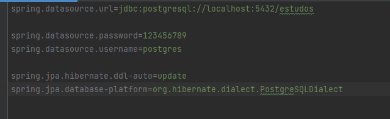

## Dependecias
para se fazer uma mesclagem do nosso banco de dados que sera usado se deve primeiro configurar as dependecias. No caso sera utilizado o banco de dados postgresql. E para dizer ao sprindo que nos usaremos o postgresql devemos colocar no arquivp de dependecias(pom.xml) que queremos utilizar.Para fazer isso é super simples basta abrir o arquivo xml e colocar a seguinte dependencia dentro da "tag" \<dependencies\> 
### ex:
~~~xml
(...)
</properties>
	<dependencies>
		<dependency>
			<groupId>org.springframework.boot</groupId>
			<artifactId>spring-boot-starter-data-jpa</artifactId>
		</dependency>
		<dependency>
			<groupId>org.postgresql</groupId>
			<artifactId>postgresql</artifactId>
		</dependency>
        (...)
    (...)
(...)
~~~
No caso foi posto a dependency org.postgresql.

## Configurando o banco de dados.
No caso quando é colocado a dependecia necessaria ao projeto podemos começar a configuração da conexão do banco. E para começar se deve abrir o arquivo que esta na parsta resources e abrir o arquivo application.properietes

 
é entrando nesse arquivo nos temos que fazer algumas configurações sendo elas

### Configurações 

>spring.datasource.url=jdbc:postgresql://localhost:5432/estudos 
>>tem a utilidade de dizer onde estao banco de dados.
>
>spring.datasource.password=123456789
>spring.datasource.username=postgres
>>Configuração da senha e o "nome do servidor"
>
>spring.jpa.hibernate.ddl-auto=update
>>Tem a utilidade de dizer que caso não haja uma determinada tabela ou atributo sera criado automaticamente antes de executar um comando sql.
>
>spring.jpa.database-platform=org.hibernate.dialect.PostgreSQLDialect
>>Tem a utilidade de dizer qual dialeto/banco_de_dados esta sendo usado. 
