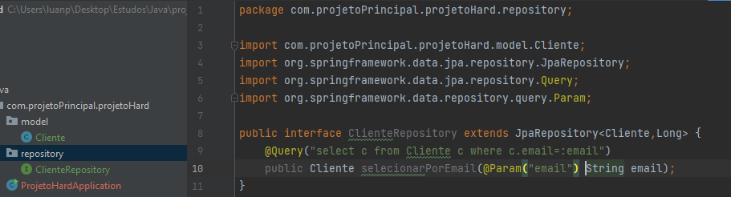

## Repositorys
Os repositorys são nada mais que interfaces que normalmente extends o JPARepository que fazem funções sql;
### Forma de implementação

para realizar a implementação de uma forma mais otimizada se recomenda a criação de packge repository e ali dentro se coloca todos os repositorys seguindo um padrão de<strong> < nome.classe>repository</strong>. 
Para realixar o extends de JpaRepository se tem que passar 2 valores em forma de list sendo o primeiro o model da classe que deseja ser utilizado e logo ao lado o tipo da chave primaria. 
